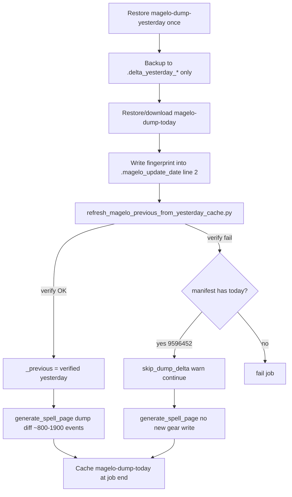

# Handoff: Gear-event CI — current state (2026-07-04 evening)

**Status:** Partially resolved — `2026-07-04` gear events **committed in repo** (`fb19313`); CI fixes through `9596452` on `main`. Jul 4 daily run may still **skip dump diff** due to stale `magelo-dump-2026-07-03` blob; Jul 5+ should heal once `magelo-dump-2026-07-04` saves with embedded fingerprint.

**Supersedes:** [GEAR_EVENT_INFLATION_HANDOFF_2026-07-04.md](GEAR_EVENT_INFLATION_HANDOFF_2026-07-04.md) (pre-fix investigation; reconstruction path since removed).

---

## Repo state (as of `9596452`)

```bash
git log -1 --oneline   # 9596452 Allow CI pass when stale yesterday cache but gear manifest has today.

python -c "import json; m=json.load(open('delta_snapshots/gear_events/manifest.json')); print(m['days']['2026-07-04'])"
# {'gear': 1794, 'char': 115, 'baseline_date': '2026-02-09', 'updated': '2026-07-04T16:06:25...'}
# Total ~1909 events (busy day; guard threshold ~871 — passed locally with true Jul3/Jul4 dumps)
```

Latest manifest days: `2026-06-30` … `2026-07-04` (no gap at Jul 4).

---

## Commit timeline (Jul 4 session)

| Commit | Summary |
|--------|---------|
| `7f5dc00` | Added gear-event reconstruction fallback — **did not fix CI** (~88k events, guard refused) |
| `fb19313` | Fingerprint module, remove reconstruction from daily path, **local Jul 4 backfill** committed |
| `8febf5e` | Cache path stability; `.delta_yesterday_*` backups; no second cache restore per job; fingerprint embedded in `.magelo_update_date` line 2 |
| `8b32d98` | `load_fingerprint(stamp_only=True)` — yesterday verify must not read today's `magelo_dump_fingerprint.json` |
| `9596452` | Stale-yesterday fallback: skip dump diff when verify fails but manifest already has export date |

---

## Root cause (confirmed)

The day-over-day source of truth is:

```
TAKP_character_inventory_previous.txt  (yesterday's Magelo export)
  vs
TAKP_character_inventory.txt             (today's export)
```

**Problem:** Actions cache key `magelo-dump-YYYY-MM-DD` can **hit** while blob **content** is from an older export (e.g. Feb 7 stamp inside `magelo-dump-2026-07-03`). Old workflow rewrote stamps to match the key date, hiding the mismatch.

**Evidence from Jul 4 CI (post-fingerprint):**

```
legacy cache export stamp date '2026-02-07' != expected '2026-07-03'
character lines 38234 != audit index 38746 for 2026-07-03
inventory lines 1697544 != audit index 1724310 for 2026-07-03
```

This is **not** delta back-and-forth or accumulated gear-event drift. Dumps are absolute snapshots; ~1.5% line-count gap with a **Feb 7 stamp** is wrong-era content. Accepting it reproduces ~88k inv-row diffs.

**Reconstruction (`day_deltas_from_event_reconstruction`) is not a valid substitute** for yesterday's dump in daily CI (single-month load bug + ~100k row drift vs real Magelo inventory even with full-era load). Removed from `_resolve_day_over_day_deltas()` in `fb19313`; kept in `gear_event_storage.py` for future delta-history work only.

---

## Current CI flow (daily-update.yml)



### Cache rules (important)

| Rule | Why |
|------|-----|
| Cache paths = **3 files only** (`character/TAKP_character.txt`, `inventory/TAKP_character_inventory.txt`, `.magelo_update_date`) | Adding paths (e.g. `magelo_dump_fingerprint.json`) changes cache **version hash** → miss on older blobs |
| **One restore per key per job** | Second `actions/cache` restore of `magelo-dump-{yesterday}` returns `cache-hit: false` even when cache exists |
| Fingerprint stored as **line 2 of `.magelo_update_date`** | Travels in cache without new paths; standalone `magelo_dump_fingerprint.json` is workspace-only (gitignored) |
| Early step **does not** copy to `_previous` until verify passes | Prevents poisoning `_previous` with unverified blob |

---

## Verification layers

| Layer | Script / location | Behavior |
|-------|-------------------|----------|
| Embedded fingerprint | [`scripts/magelo_dump_fingerprint.py`](../scripts/magelo_dump_fingerprint.py) | MD5 + line counts on stamp line 2; `stamp_only=True` when checking yesterday backup |
| Legacy stamp | same | Fail if line 1 calendar date ≠ expected cache key date |
| Audit index | [`character/.magelo_dump_index.json`](../character/.magelo_dump_index.json) | Committed line counts for Jul 3–4; secondary check when no fingerprint on line 2 |
| Pre-generate span | [`scripts/validate_magelo_delta_date_span.py`](../scripts/validate_magelo_delta_date_span.py) | ≤2 day stamp span; char/inv line count ≤10%; skipped when `skip_dump_delta` |
| Inflation guard | [`gear_event_storage.py`](../gear_event_storage.py) `guard_gear_event_write()` | Refuses writes >> manifest median (~5× + 2000) |
| Line-count pre-check | [`generate_spell_page.py`](../generate_spell_page.py) `_dump_line_counts_look_stale()` | Skip heavy inventory parse if prev/curr lines diverge >5% |

---

## Jul 4 backfill (done locally, in git)

Files used (not in repo — `character/*.txt` gitignored):

- `_previous` ← Jul 3 export (was workspace `TAKP_character.txt` before Jul 4 download)
- current ← Jul 4 download from TAKP

```powershell
$env:MAGELO_UPDATE_DATE = "Sat Jul  4 16:30:25 UTC 2026"
python generate_spell_page.py
python scripts/audit_gear_events.py --base-dir delta_snapshots --min-events-after 2026-06-27 --fail-on-issue
```

Result: `Saved gear_events: 1794 inventory rows, 115 stat rows` — committed in `fb19313`.

---

## Root cause (cache poisoning) — fixed 2026-07-05

Three bugs in `daily-update.yml` caused **Feb-era file content under Jul cache keys**:

1. **End-of-job `actions/cache` with `restore-keys: magelo-dump-`** — the save step **restored** an arbitrary old blob into the workspace, then **saved it** under today's key. (`regenerate-delta-days.yml` already documented "exact key only" for dumps; daily-update did not.)
2. **Start-of-job `cache-magelo` also used `restore-keys`** — on exact-key miss, any prior day's dump could land in `TAKP_character.txt` before the need-update check.
3. **`need-update` compared stamp line 1 only** — if a poisoned blob's stamp was rewritten to match scrape date, download was skipped and wrong char/inv were kept.

**Fix:** `cache/restore` exact key only (no `restore-keys` on dumps); `need-update` requires fingerprint/audit verify before skip-download; end job uses `cache/save` only (no restore-before-save).

Verification on **read** (`prepare_magelo_previous_for_ci.py`) was working; **write** path was re-poisoning the cache every run.

---

## Known open issues

### 1. Stale `magelo-dump-2026-07-03` Actions cache

- Cache **entry exists** in GitHub Caches UI but content is **Feb 7 era** (stamp + line counts prove it).
- **No cache repair required** for Jul 4 fix — local verified Jul 3 `_previous` + TAKP Jul 4 export validated PASS (~2165 est. events); gear shards regenerated locally. See [`GEAR_EVENT_JUL3_RESEED_HANDOFF_2026-07-04.md`](GEAR_EVENT_JUL3_RESEED_HANDOFF_2026-07-04.md).
- **`9596452` fallback:** Jul 4 CI warns, skips dump diff, continues if manifest has `2026-07-04`.
- **`delta.html`** regenerated locally from true Jul 3 `_previous` vs Jul 4 current.

### 2. Jul 5 expectation

If Jul 4 job completes and saves `magelo-dump-2026-07-04` at end (with line-2 fingerprint):

- Jul 5 run: yesterday = Jul 4 → should verify and produce normal ~800–1100 event write for Jul 5.
- Monitor: no `legacy cache export stamp` errors for Jul 4 key.

### 3. SYSTEM_MAP.md drift

[`SYSTEM_MAP.md`](../SYSTEM_MAP.md) §2.2 still mentions `magelo_dump_fingerprint.json` in cache paths — **outdated**; fingerprint is embedded in `.magelo_update_date` line 2.

### 4. Jul 4 event count vs median

Jul 4 total ~1909 vs median ~871 — passed guard locally with true dumps; may reflect a heavy day or broader diff window. Watch Jul 5 for return to ~800–1100 band.

---

## Key files

| Concern | Location |
|---------|----------|
| Workflow cache choreography | [`.github/workflows/daily-update.yml`](../.github/workflows/daily-update.yml) |
| Fingerprint write/verify | [`scripts/magelo_dump_fingerprint.py`](../scripts/magelo_dump_fingerprint.py) |
| Yesterday → `_previous` | [`scripts/refresh_magelo_previous_from_yesterday_cache.py`](../scripts/refresh_magelo_previous_from_yesterday_cache.py) |
| Stale fallback gate | [`scripts/check_gear_manifest_date.py`](../scripts/check_gear_manifest_date.py) |
| Pre-generate validation | [`scripts/validate_magelo_delta_date_span.py`](../scripts/validate_magelo_delta_date_span.py) |
| Dump diff / no reconstruction | [`generate_spell_page.py`](../generate_spell_page.py) `_resolve_day_over_day_deltas()`, `_dump_line_counts_look_stale()` |
| Inflation guard | [`gear_event_storage.py`](../gear_event_storage.py) `guard_gear_event_write()` |
| Audit index | [`character/.magelo_dump_index.json`](../character/.magelo_dump_index.json) |
| Gear manifest | [`delta_snapshots/gear_events/manifest.json`](../delta_snapshots/gear_events/manifest.json) |

---

## Verification checklist (healthy daily run)

- [ ] Early log: `Yesterday backups ready for fingerprint verify`
- [ ] `refresh_magelo_previous` → `OK Copied yesterday cache into _previous` (not stale fallback)
- [ ] No `legacy cache export stamp date` / `audit index` mismatch errors
- [ ] No `skip_dump_delta=true` (fallback path)
- [ ] `Saved gear_events: ~800–1100` (or explain busy day if higher)
- [ ] No `Refusing gear-event write`
- [ ] `audit_gear_events.py --min-events-after` passes
- [ ] Bot commit adds export date to manifest (if new day)
- [ ] `generate_spell_page.py` ~1–2 min
- [ ] End of job: `magelo-dump-{today}` cache saved (check Caches UI next day)

---

## Local debug commands

```powershell
cd c:\TAKP\magelo

# Manifest
python -c "import json; m=json.load(open('delta_snapshots/gear_events/manifest.json')); print(sorted(m['days'])[-5:])"

# Audit index vs local dumps
python -c "import json; from pathlib import Path; idx=json.load(open('character/.magelo_dump_index.json')); print(idx)"

# Fingerprint on stamp file
python -c "from scripts.magelo_dump_fingerprint import load_fingerprint, read_stamp_line; from pathlib import Path; print('stamp', read_stamp_line(Path('.magelo_update_date'))); print('fp', load_fingerprint(stamp_path=Path('.magelo_update_date'), stamp_only=True))"

# Manifest date check (fallback gate)
python scripts/check_gear_manifest_date.py --date 2026-07-04

# Tests
python -m unittest tests.test_delta_history_gear_path tests.test_gear_event_storage -v
```

---

## Recommended next steps

1. **Confirm Jul 4 CI completes** with `9596452` (warning + skip_dump_delta, deploy succeeds).
2. **Confirm Jul 5 run** uses verified `magelo-dump-2026-07-04` — first true end-to-end fingerprint path.
3. **Optional:** Delete stale `magelo-dump-2026-07-03` in GitHub → Settings → Actions → Caches (or let it LRU-expire); not required if fallback + Jul 4 cache work.
4. **Update SYSTEM_MAP.md** §2.2 — remove standalone fingerprint from cache paths; document `.delta_yesterday_*` + line-2 embed.
5. **If Jul 3 cache must be repaired:** optional only — primary path is local `validate_day_over_day_dump_diff.py` (see Jul 3 handoff). Cache re-seed not required for Jul 4 fix.
6. **Do not re-enable** `day_deltas_from_event_reconstruction()` in daily `_resolve_day_over_day_deltas()` without proven dump parity.

---

## Summary for next agent

**Verification is working as designed** — it correctly rejects Feb-era content under the Jul 3 cache key. That is not a tolerance tuning problem. Forward path: Jul 4 gear events are already in git; CI uses manifest fallback when yesterday cache is stale; tonight's job should seed a **good** `magelo-dump-2026-07-04` for tomorrow. Do not relax stamp/index checks without a new source of truth for yesterday's dump.
